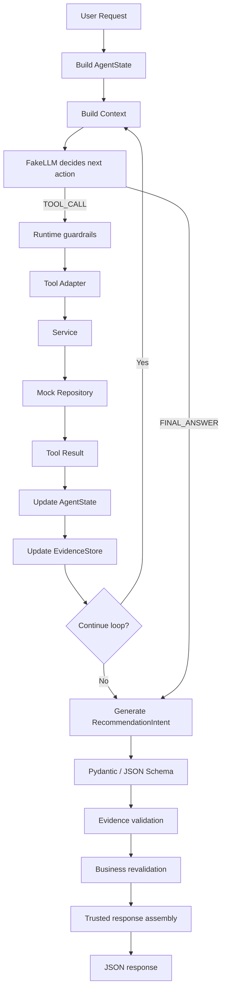

# JSONSchemaDemo 操作手册

这是一个可以在本地离线运行的餐厅推荐 Agent Demo。它用确定性的 `FakeLLM` 模拟模型决策，完整演示：模型选择下一步动作，Runtime 执行工具并维护证据，最后用 JSON Schema、证据和业务数据三层校验组装可信响应。

默认运行不需要 API Key、数据库、网络服务或其他外部基础设施。

## Demonstrates

- 显式 Agent Loop：`TOOL_CALL`、`FINAL_ANSWER` 和 `AgentState`。
- Tool Registry、Service、Repository 分层，以及工具预算、循环预算和重复调用保护。
- `asyncio` 超时、一次重试、有界并发和单门店失败隔离。
- Pydantic/JSON Schema 结构化输出、EvidenceStore 证据校验、业务复校验和可信 DTO 组装。
- 结构化运行事件；不记录模型隐藏推理。

## 1. 先跑起来

### 1.1 环境要求

- Windows PowerShell
- Python 3.12 或更高版本
- Pydantic v2
- 工作区根目录已有 `.venv` 时，优先复用它：`D:\python\langchainlearn\.venv`

先确认解释器和依赖：

```powershell
Set-Location D:\python\langchainlearn
.\.venv\Scripts\python.exe --version
.\.venv\Scripts\python.exe -c "import pydantic; print('pydantic', pydantic.__version__)"
```

### 1.2 安装

如果工作区虚拟环境已经包含 Pydantic 和 pytest，只需把 Demo 以 editable 包安装（也可以跳过这一步，按下一节设置 `PYTHONPATH` 直接运行）：

```powershell
Set-Location D:\python\langchainlearn\JSONSchemaDemo
..\.venv\Scripts\python.exe -m pip install -e . --no-deps
```

如果需要从零创建环境：

```powershell
Set-Location D:\python\langchainlearn
py -3.12 -m venv .venv
.\.venv\Scripts\python.exe -m pip install -e .\JSONSchemaDemo
.\.venv\Scripts\python.exe -m pip install pytest
```

如果系统没有 `py` 启动器，可将第一条命令中的 `py -3.12` 换成已确认是 Python 3.12+ 的 `python`。

`pyproject.toml` 声明的运行时依赖只有 `pydantic>=2`；pytest 只用于测试，不是 Demo 运行时依赖。

### 1.3 运行默认示例

不安装包也可以运行：

```powershell
Set-Location D:\python\langchainlearn\JSONSchemaDemo
$env:PYTHONPATH = "$PWD\src"
..\.venv\Scripts\python.exe -m agent_demo
```

`PYTHONPATH` 只对当前 PowerShell 会话生效。若已经执行过 editable 安装，也可以直接运行：

```powershell
Set-Location D:\python\langchainlearn\JSONSchemaDemo
..\.venv\Scripts\python.exe -m agent_demo
```

当前 CLI 是固定示例入口，不解析命令行参数。它使用以下输入调用 `create_demo_app().run(...)`：

```text
用户请求：帮我找附近评分高的川菜，两个人吃，最好有套餐。
坐标：lat=31.2304, lng=121.4737
分类：川菜
人数：2
```

默认流程会先查最近的 S1，再查 S2；S2 有合适的双人套餐，因此不会继续查询 S3。

这是模块 CLI 和 Python API 示例，不包含 HTTP 服务或 Web UI。

## 2. 预期输出

正常运行会打印一份 JSON：

```json
{
  "status": "SUCCESS",
  "recommendation_type": "PACKAGE",
  "store_id": "S2",
  "store_name": "锦城川菜",
  "products": [
    {
      "product_id": "P2001",
      "name": "双人川味套餐",
      "price": 128
    }
  ],
  "reason": "优先选择了已验证的双人套餐。",
  "warnings": []
}
```

字段含义：

| 字段 | 含义 |
| --- | --- |
| `status` | `SUCCESS` 成功；`NO_RESULT` 没有可推荐结果；`FAILED` 触发受控失败；响应模型还预留 `PARTIAL_SUCCESS`。 |
| `recommendation_type` | `PACKAGE` 套餐，或 `SINGLE_ITEMS` 单品。 |
| `store_id` / `store_name` | 最终通过校验的门店 ID 和名称。 |
| `products` | 从 Repository 重新读取后组装的商品，不直接信任模型传入的名称和价格。 |
| `reason` | 模型生成的解释文本。 |
| `warnings` | 超时、重试、校验失败等可观察信息。 |

## 3. 使用 Python API 自定义运行

需要自定义用户请求、人数、分类或 Fake 场景时，调用 `create_demo_app`。下面的 PowerShell 片段可以直接复制执行：

```powershell
Set-Location D:\python\langchainlearn\JSONSchemaDemo
$env:PYTHONPATH = "$PWD\src"
@'
import asyncio

from agent_demo.app import create_demo_app
from agent_demo.llm.fake import FakeScenario


async def main() -> None:
    app = create_demo_app(FakeScenario.NO_PACKAGE)
    run = await app.run(
        user_query="找附近川菜，没有套餐就推荐单品。",
        lat=31.2304,
        lng=121.4737,
        category="川菜",
        people_count=2,
    )
    print(run.response.model_dump_json(indent=2))


asyncio.run(main())
'@ | ..\.venv\Scripts\python.exe -
```

`AgentDemoApp.run` 的参数是：

| 参数 | 默认值 | 说明 |
| --- | --- | --- |
| `user_query` | 无 | 用户的推荐请求。 |
| `lat` / `lng` | 无 | 纬度和经度，分别限制在 `[-90, 90]`、`[-180, 180]`。 |
| `category` | `川菜` | 门店分类，不能为空。 |
| `people_count` | `2` | 用于判断套餐是否适合。 |

## 4. Fake 场景

场景通过 `create_demo_app(FakeScenario.<场景名>)` 选择，CLI 默认使用 `PACKAGE_SECOND_STORE`。场景不是命令行参数，想切换场景请使用 Python API。

| 场景 | 用途 | 典型结果 |
| --- | --- | --- |
| `PACKAGE_SECOND_STORE` | 默认：第二家门店有套餐。 | `SUCCESS`，门店 `S2`。 |
| `PACKAGE_FIRST_STORE` | 第一家门店就有套餐，验证提前停止。 | `SUCCESS`，门店 `S1`。 |
| `NO_PACKAGE` | 五家门店都没有合适套餐，回退到单品。 | `SUCCESS`，类型 `SINGLE_ITEMS`。 |
| `HALLUCINATED_ID` | 模型返回不存在的商品 ID。 | 证据校验失败，不能返回 `P9999`。 |
| `ALTERED_DISPLAY_FACTS` | 模型篡改门店名、商品名或价格。 | 仍返回 Repository 中的真实字段。 |
| `INVALID_OUTPUT_ONCE` | 第一次结构化输出非法，第二次修复。 | 允许一次修复后成功。 |
| `INVALID_OUTPUT_TWICE` | 连续两次结构化输出非法。 | 受控 `FAILED`。 |
| `REPEATED_TOOL_CALL` | 重复相同工具调用。 | 超过策略后阻断。 |
| `NEVER_FINAL` | 模型始终不结束循环。 | 到达循环预算后 `FAILED`。 |
| `SIXTH_STORE` | 模型尝试查询第六家门店。 | 超过最多五家门店的预算后阻断。 |
| `INVALID_TOOL_NAME` | 模型调用未注册工具。 | `unknown tool`，且不会执行工具。 |

例如，将上面的 `FakeScenario.NO_PACKAGE` 改成 `FakeScenario.PACKAGE_FIRST_STORE`，即可观察第一家门店命中套餐的路径。

## 5. JSON Schema 怎么看

最终意图模型是 `RecommendationIntent`。可以打印它暴露给真实结构化输出适配器的 JSON Schema：

```powershell
Set-Location D:\python\langchainlearn\JSONSchemaDemo
$env:PYTHONPATH = "$PWD\src"
@'
import json

from agent_demo.validation.output import recommendation_intent_json_schema


print(json.dumps(
    recommendation_intent_json_schema(),
    ensure_ascii=False,
    indent=2,
))
'@ | ..\.venv\Scripts\python.exe -
```

`RecommendationIntent` 的结构化字段约束包括：

- `recommendation_type`：`PACKAGE` 或 `SINGLE_ITEMS`；
- 字符串类型的 `store_id`；它是否由本次工具返回由下一层 Evidence validation 保证；
- 至少一个 `product_ids`；
- 非空 `reason`。

模型可以提出 ID 和解释，但不能把自己的名称、价格等字段当成事实来源。

## 6. 运行测试

从工作区根目录执行完整测试：

```powershell
Set-Location D:\python\langchainlearn
.\.venv\Scripts\python.exe -m pytest JSONSchemaDemo -q
```

当前基线应全部通过（最近一次验证为 `21 passed`）。测试完全离线，覆盖：

- 首家/次家门店命中套餐以及命中后的提前停止；
- 五家门店无套餐时回退到单品；
- 幻觉商品 ID、篡改显示字段；
- 非法结构化输出的一次修复和最终失败；
- 重复工具调用、未知工具和非法参数；
- 工具超时、一次重试、连续超时后的跳过；
- 总请求截止时间、循环预算、工具调用预算和最多五家门店；
- 业务数据在最终组装前变为不可用；
- CLI 模块入口和结构化可观测事件。

也可以只运行某一类测试：

```powershell
.\.venv\Scripts\python.exe -m pytest JSONSchemaDemo\tests\test_agent_loop.py -q
.\.venv\Scripts\python.exe -m pytest JSONSchemaDemo\tests\test_timeout_retry.py -q
```

## 7. 执行流程与架构



Runtime 和模型的职责边界是：

- 模型决定“想调用哪个工具、何时结束、选择哪些 ID”；
- Runtime 决定“这个动作是否允许、是否超时、是否重试、是否有证据”；
- Python 最后从重新读取的 `Store` / `Product` 组装 `RecommendationResponse`。

默认策略如下：

| 策略 | 默认值 |
| --- | ---: |
| 最大循环次数 `max_loop_count` | 12 |
| 最大工具调用次数 `max_tool_calls` | 10 |
| 最多考虑门店数 `max_stores` | 5 |
| 单工具超时 `tool_timeout_seconds` | 2 秒 |
| 重试次数 `retry_count` | 1 |
| 有界并发 `max_concurrency` | 3 |
| 总请求截止时间 `total_deadline_seconds` | 8 秒 |
| 相同工具调用重复阈值 `max_same_tool_call_repeats` | 1 |
| 结构化输出修复次数 `max_output_repair_attempts` | 1 |

主推荐流程按距离从近到远查询门店，命中合适套餐即可停止；`execute_bounded` 另外提供共享并发上限的异步执行 helper。

## 8. 三层校验

### 第一层：Pydantic / JSON Schema

把模型最终输出解析为 `RecommendationIntent`，检查 JSON 对象、必填字段、枚举、类型和列表长度。非法时最多允许一次修复，不能无限重试。

### 第二层：Evidence validation

检查最终意图是否忠实于本次运行的工具结果：

- `store_id` 必须出现在本次 `EvidenceStore`；
- 每个 `product_id` 必须由工具返回；
- 商品必须属于选中的门店；
- `PACKAGE` 必须是真套餐，且满足请求人数。

因此，模型即使返回 `P9999`，也不能绕过 Runtime 进入 API 响应。

### 第三层：Business revalidation

在响应组装前重新读取 Repository，确认门店和商品仍存在、可用、关系未变化，套餐规则仍满足。若事实已经过期，返回受控失败，不返回旧的名称或价格。

最终响应不是 `return llm_raw_json`，而是由 Python 根据校验后的领域对象重建：

```text
RecommendationIntent
    -> validated IDs
    -> Repository / Service 重新读取
    -> RecommendationResponse
    -> response.model_dump()
```

## 9. 代码目录

```text
JSONSchemaDemo/
├── pyproject.toml                 # 项目元数据、依赖和 pytest 配置
├── README.md                      # 本操作手册
├── doc/agent-loop-demo-spec.md    # 实现规格说明
├── src/agent_demo/
│   ├── __main__.py                # python -m agent_demo 入口
│   ├── app.py                     # Demo 组装和 AgentDemoApp.run
│   ├── agent/
│   │   ├── loop.py                # Agent Loop 和最终响应流程
│   │   ├── runtime.py             # 工具注册、预算、超时、重试
│   │   ├── policy.py              # AgentPolicy
│   │   ├── state.py               # AgentState、EvidenceStore
│   │   └── models.py              # TOOL_CALL / FINAL_ANSWER 动作
│   ├── llm/fake.py                # FakeScenario 和 FakeLLM
│   ├── tools/                     # 工具适配器与 ToolRegistry
│   ├── services/                  # Service 和最终业务复校验
│   ├── repositories/              # 内存 MockRestaurantRepository
│   ├── validation/                # 输出、证据、业务三层校验
│   ├── dto/                       # Store、Product、Response 等 Pydantic 模型
│   └── observability/             # TraceRecorder 结构化事件
└── tests/                         # 全部离线测试
```

短期 `AgentState` 只服务于当前一次运行；它不等同于长期用户记忆、会话历史或 RAG 结果。未来接入真实 LLM 时，核心 Loop 可以复用 `LLMClient` 接口；当前 `create_demo_app` 工厂仍固定使用 `FakeLLM`。工具可以通过 `AgentTool`/`ToolRegistry` 替换为远程或 MCP 适配器，但实时业务字段仍必须回到业务 Service/Repository 校验。

## 10. 查看运行轨迹

`TraceRecorder` 只记录操作事件，不记录模型隐藏推理。下面的片段可以直接查看本次运行的事件：

```python
import asyncio

from agent_demo.app import create_demo_app


async def main() -> None:
    app = create_demo_app()
    await app.run("找附近川菜。", lat=31.2304, lng=121.4737)

    for event in app.tracer.events:
        print(event.name, event.data)


asyncio.run(main())
```

常见事件包括 `loop_started`、`llm_action`、`tool_started`、`tool_finished`、`tool_retry`、`validation_failure` 和 `final_status`。

## 11. 常见问题

### `No module named agent_demo`

请确认当前目录是 `JSONSchemaDemo`，并执行：

```powershell
$env:PYTHONPATH = "$PWD\src"
```

或者重新执行 `pip install -e . --no-deps`。

### `No module named pydantic`

当前解释器没有运行时依赖。使用同一个 `.venv` 安装项目依赖：

```powershell
..\.venv\Scripts\python.exe -m pip install -e .
```

### 终端中文显示异常

这通常是 PowerShell 输出编码问题，不影响 JSON 和测试逻辑。请确认文件以 UTF-8 保存，并在支持 UTF-8 的终端中运行。

### 为什么不能直接执行 `python -m agent_demo --scenario ...`

当前 `__main__.py` 没有实现参数解析。要切换 Fake 场景或修改请求，请使用第 3 节的 Python API。

## 12. Java 后端概念映射

| Java 后端概念 | Python Agent 对应物 |
| --- | --- |
| Spring Service | Python service layer |
| Repository / Mapper | repository / client abstraction |
| DTO | Pydantic model |
| Bean Validation | Pydantic / JSON Schema validation |
| CompletableFuture | `asyncio` Task / `gather` / `TaskGroup` |
| Semaphore | `asyncio.Semaphore` |
| Thread pool isolation | bounded async concurrency / executor when needed |
| RetryTemplate / Resilience4j | retry wrapper / custom policy |
| Request Context | `AgentState` |
| Business validation | validation service |
| Transaction / idempotency | business service + DB guarantee |
| Controller response DTO | trusted Pydantic response model |
