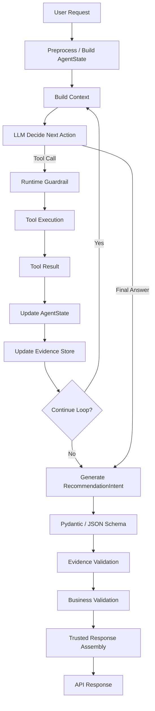

# Agent Loop Demo — Implementation Spec

**Status:** Ready for implementation  
**Target:** Codex / local coding agent  
**Language:** Python 3.12+  
**Primary goal:** Build a small but production-minded Agent Runtime demo that shows the full path from user input → LLM decision → Tool Calling → Tool Result → Agent State / Evidence Store → loop guardrails → structured output → JSON/Pydantic validation → Evidence Validation → Business Validation → trusted API response.

---

## 0. Non-negotiable constraints

1. **Do not perform any version-control operation.**
   - Do not run `git`, `svn`, `hg`, or equivalent commands.
   - Do not commit, checkout, branch, merge, revert, reset, pull, push, or modify repository metadata.
   - Work only on files in the working directory.

2. The demo must be runnable locally without external infrastructure.

3. External LLM access must be abstracted behind an interface.
   - The default demo must include a deterministic `FakeLLM` so tests can run without API keys.
   - An optional real LLM adapter may be added, but it must not be required for acceptance.

4. The LLM may make decisions, but it must **not own reliability guarantees**.
   - Tool-call budgets, timeouts, retries, concurrency, evidence validation, final business validation, and API response construction belong to Python code.

5. Never return the LLM's raw final JSON directly to the caller.

---

# 1. Demo scenario

Implement a simplified restaurant recommendation Agent.

User request example:

```text
帮我找附近评分高的川菜，两个人吃，最好有套餐，没有套餐就推荐几个单品。
```

The Agent has access to two tools:

```python
async def search_nearby_stores(
    lat: float,
    lng: float,
    category: str,
) -> list[Store]:
    ...

async def search_products(store_id: str) -> list[Product]:
    ...
```

Business rules:

- Search nearby Sichuan restaurants first.
- At most 5 stores may be considered.
- Stores are processed from nearest to farthest.
- Prefer a package suitable for 2 people.
- If a suitable package is found, the Agent may stop searching further stores.
- If all considered stores have no suitable package, recommend suitable single products collected from previous Tool Results.
- Every store/product fact in the final response must be traceable to Tool Results.
- The LLM must never invent store IDs, product IDs, prices, names, or package flags.

---

# 2. What this demo must demonstrate

The demo is not primarily about UI. It must clearly demonstrate these backend/Agent engineering concepts:

1. Agent Loop
2. LLM autonomous next-step decision
3. Tool Registry / Tool execution
4. Agent State
5. Tool Evidence Store
6. Loop guardrails
7. Async Tool execution
8. Timeout + retry
9. Optional concurrency limit
10. Partial failure tolerance
11. Pydantic / JSON Schema structured output
12. Evidence Validation
13. Business Validation
14. Trusted final DTO construction
15. Observability hooks
16. Clean separation of Agent / Runtime / Tool / Service / Repository / DTO

---

# 3. High-level architecture

Implement this logical flow:

```text
User Request
    ↓
Request Preprocessing
    ↓
Load / Build AgentState
    ↓
Build LLM Context
    ↓
┌───────────────────────────────┐
│          Agent Loop           │
│                               │
│  LLM decides next action      │
│      ↓                        │
│  TOOL_CALL or FINAL_ANSWER    │
│      ↓                        │
│  Runtime policy check         │
│      ↓                        │
│  Tool execution               │
│      ↓                        │
│  Tool Result                  │
│      ↓                        │
│  Update AgentState            │
│      ↓                        │
│  Update Evidence Store        │
│      ↓                        │
│  Loop Guardrail               │
└───────────────────────────────┘
    ↓
LLM Structured Final Output
    ↓
Pydantic / JSON Schema Validation
    ↓
Evidence Validation
    ↓
Business Validation
    ↓
Trusted Response Assembly
    ↓
Return API Response
```

---

# 4. Required project structure

Create a clean structure similar to:

```text
agent_loop_demo/
├── README.md
├── pyproject.toml
├── src/
│   └── agent_demo/
│       ├── __init__.py
│       ├── app.py
│       ├── agent/
│       │   ├── loop.py
│       │   ├── runtime.py
│       │   ├── policy.py
│       │   ├── state.py
│       │   └── models.py
│       ├── llm/
│       │   ├── base.py
│       │   ├── fake.py
│       │   └── prompts.py
│       ├── tools/
│       │   ├── registry.py
│       │   ├── store_tool.py
│       │   └── product_tool.py
│       ├── services/
│       │   ├── store_service.py
│       │   ├── product_service.py
│       │   └── validation_service.py
│       ├── repositories/
│       │   └── mock_repository.py
│       ├── validation/
│       │   ├── evidence.py
│       │   ├── business.py
│       │   └── output.py
│       ├── dto/
│       │   ├── domain.py
│       │   └── response.py
│       └── observability/
│           └── tracing.py
└── tests/
    ├── test_agent_loop.py
    ├── test_evidence_validation.py
    ├── test_business_validation.py
    ├── test_timeout_retry.py
    └── test_structured_output.py
```

Minor naming changes are acceptable if responsibilities remain clear.

---

# 5. Domain models

Use Pydantic v2 models.

## 5.1 Store

Minimum fields:

```python
class Store(BaseModel):
    store_id: str
    name: str
    category: str
    rating: float
    distance_meters: int
    available: bool = True
```

## 5.2 Product

Minimum fields:

```python
class Product(BaseModel):
    product_id: str
    store_id: str
    name: str
    price: int
    is_package: bool
    suitable_people: int | None = None
    available: bool = True
```

`price` may be represented as integer cents or integer demo currency units. Pick one approach and keep it consistent.

## 5.3 Final recommendation intent

This is the **LLM-selected structured output**, not yet the final trusted API response.

```python
class RecommendationIntent(BaseModel):
    recommendation_type: Literal["PACKAGE", "SINGLE_ITEMS"]
    store_id: str
    product_ids: list[str]
    reason: str
```

Important:

- The LLM should primarily select IDs and write explanation text.
- Do not rely on LLM-generated price/name values as authoritative data.

## 5.4 Final trusted response

Example:

```python
class RecommendedProduct(BaseModel):
    product_id: str
    name: str
    price: int


class RecommendationResponse(BaseModel):
    status: Literal["SUCCESS", "NO_RESULT", "PARTIAL_SUCCESS", "FAILED"]
    recommendation_type: Literal["PACKAGE", "SINGLE_ITEMS"] | None = None
    store_id: str | None = None
    store_name: str | None = None
    products: list[RecommendedProduct] = []
    reason: str | None = None
    warnings: list[str] = []
```

The final response must be built in Python from validated authoritative data.

---

# 6. Agent State

Create an explicit `AgentState` model. Do not hide runtime state only inside chat messages.

Minimum suggested fields:

```python
class AgentState(BaseModel):
    request_id: str
    session_id: str

    user_query: str
    lat: float
    lng: float
    category: str = "川菜"
    people_count: int = 2

    messages: list[dict] = []

    tool_call_count: int = 0
    loop_count: int = 0

    searched_store_ids: list[str] = []
    failed_store_ids: list[str] = []
    timed_out_store_ids: list[str] = []

    selected_store_id: str | None = None
    selected_product_ids: list[str] = []

    stores: dict[str, Store] = {}
    products: dict[str, Product] = {}

    final_intent: RecommendationIntent | None = None
```

Also track enough information to detect repeated Tool Calls.

Example:

```python
executed_tool_signatures: set[str]
```

A Tool signature can be derived from:

```text
tool_name + normalized arguments
```

---

# 7. Evidence Store

Evidence Store is a first-class part of the Runtime.

Purpose:

> Record business facts actually returned by trusted tools during the current Agent run.

Minimum structures:

```python
class EvidenceStore:
    stores: dict[str, Store]
    products: dict[str, Product]
```

Whenever a Tool returns data:

```text
Tool Result
    ↓
normalize / validate
    ↓
AgentState
    ↓
EvidenceStore
```

The final LLM answer must not introduce new authoritative IDs or facts outside the Evidence Store.

Example:

```text
Tool returned product IDs:
P1001
P1002
P1003

LLM final intent contains:
P9999

=> Evidence Validation FAIL
```

This is a hard runtime validation, not a prompt-only rule.

---

# 8. LLM abstraction

Define an interface/protocol such as:

```python
class LLMClient(Protocol):
    async def decide_next_action(...): ...
    async def generate_final_intent(...): ...
```

The default demo must use `FakeLLM`.

`FakeLLM` should be deterministic and support predefined scenarios:

1. Normal Tool Calling
2. Find package at first/second store
3. No package across five stores → recommend singles
4. LLM hallucinates a non-existent product ID
5. LLM repeats the same Tool Call
6. LLM returns malformed/invalid structured output once, then valid output

Real-provider integration is optional.

---

# 9. Agent decisions

Model LLM next-step output explicitly.

Recommended models:

```python
class ToolCallAction(BaseModel):
    type: Literal["TOOL_CALL"]
    tool_name: str
    arguments: dict


class FinalAnswerAction(BaseModel):
    type: Literal["FINAL_ANSWER"]


class AskUserAction(BaseModel):
    type: Literal["ASK_USER"]
    question: str
```

A discriminated union is preferred.

The LLM decides **what it wants to do next**.

The Runtime decides **whether it is allowed to do it**.

---

# 10. Runtime policy / guardrails

Create an `AgentPolicy` configuration.

Suggested defaults:

```python
class AgentPolicy(BaseModel):
    max_loop_count: int = 12
    max_tool_calls: int = 10
    max_stores: int = 5

    tool_timeout_seconds: float = 2.0
    retry_count: int = 1

    max_concurrency: int = 3
    total_deadline_seconds: float = 8.0

    max_same_tool_call_repeats: int = 1
    max_output_repair_attempts: int = 1
```

The Runtime must enforce these rules independently of the Prompt.

## Required guardrails

1. Max loop count
2. Max Tool Call count
3. Max stores = 5
4. Same Tool + same arguments repeated too many times → reject / stop
5. Total request deadline
6. Per-tool timeout
7. Retry limit
8. Invalid Tool name → reject
9. Invalid Tool arguments → reject
10. Tool execution failure must not corrupt AgentState
11. Evidence validation before final return

---

# 11. Tool layer

Tools must be thin adapters.

Example responsibility:

```text
LLM-visible Tool
    ↓
Tool adapter
    ↓
Service
    ↓
Repository / external client
```

Do not put all business logic inside `@tool` functions.

## 11.1 search_nearby_stores

Behavior:

- Validate category and location input.
- Call `StoreService`.
- Sort nearest → farthest.
- Return at most 5 stores to the Agent.
- Only available stores should normally be returned.

## 11.2 search_products

Behavior:

- Input must be a known store ID from Evidence Store.
- If store previously timed out and policy says skip it, reject another call.
- Call ProductService with timeout/retry policy.
- Add valid products to Evidence Store.

---

# 12. Async, timeout, retry and concurrency

Use native `asyncio`.

Preferred primitives:

- `asyncio.timeout()` or `asyncio.wait_for()`
- `asyncio.Semaphore(max_concurrency)` when bounded concurrency is needed
- `asyncio.TaskGroup` where structured concurrency improves clarity

The demo's primary happy path may remain nearest-first sequential because business logic can break as soon as a suitable package is found.

However, the runtime should include a reusable bounded async execution helper demonstrating:

```text
max concurrency = 3
per-call timeout = 2s
retry = 1
partial failure supported
```

If a Tool times out twice:

```text
TIMEOUT
→ retry once
→ TIMEOUT
→ mark store timed_out
→ log warning
→ skip this store for subsequent calls
→ continue Agent if useful evidence exists
```

A single store failure must not necessarily fail the entire Agent.

---

# 13. Business search policy

The runtime must support the following business strategy:

```text
search_nearby_stores
    ↓
nearest store
    ↓
search_products
    ↓
has suitable 2-person package?
   ├─ YES → package candidate available → allow loop to end
   └─ NO  → save valid singles → next store

repeat up to 5 stores

if all considered stores have no package:
    choose from previously collected single products
```

The LLM may decide to call the next Tool, but Runtime constraints must prevent it from exceeding the business budget.

If the demo uses a deterministic business helper to evaluate whether a product qualifies as a 2-person package, document it clearly.

---

# 14. Structured output

The final LLM stage must use Pydantic / JSON Schema structured output semantics.

The intended model is:

```python
RecommendationIntent
```

Prompt may explain the rules, but validation must not depend on prompt compliance.

Required validation pipeline:

```text
LLM Final Output
    ↓
1. JSON / Pydantic Validation
    ↓
2. Evidence Validation
    ↓
3. Business Validation
    ↓
4. Trusted Response Assembly
```

---

# 15. Validation layer 1 — JSON / Pydantic

Validate:

- parseable JSON / object
- required fields
- enum values
- type constraints
- list sizes
- basic field rules

If structured output is invalid:

```text
first failure
→ allow one repair/regeneration attempt

second failure
→ fail safely with controlled runtime error
```

Do not retry indefinitely.

---

# 16. Validation layer 2 — Evidence Validation

This is mandatory.

Validate that every authoritative business reference in `RecommendationIntent` is backed by this run's Tool Results.

At minimum:

```text
intent.store_id ∈ EvidenceStore.stores

for product_id in intent.product_ids:
    product_id ∈ EvidenceStore.products
    EvidenceStore.products[product_id].store_id == intent.store_id
```

If recommendation type is `PACKAGE`:

```text
selected product must have is_package == True
selected product must be suitable for >= requested people count
```

If recommendation type is `SINGLE_ITEMS`:

```text
product IDs must all be real evidence
```

If any rule fails:

- Do not return the hallucinated result.
- Record validation error.
- Optionally allow one final-output regeneration using explicit validation feedback.
- If still invalid, fail safely.

The LLM should never be able to bypass this check.

---

# 17. Validation layer 3 — Business Validation

Evidence Validation answers:

> Did the LLM stay faithful to what the tools returned?

Business Validation answers:

> Are those facts still valid right now?

Before final response, call `ValidationService` / `ProductService` to re-check selected entities.

For the demo, business validation must at least verify:

- selected store still exists
- selected store still available
- selected products still exist
- selected products still available
- products belong to selected store
- package flag / people count still satisfies rules

Optional:

- price freshness
- store operating status

If selected product becomes unavailable after LLM selection:

```text
revalidation FAIL
→ do not return stale product
→ either:
   a) choose next valid evidence candidate, or
   b) rerun recommendation step once, or
   c) return controlled NO_RESULT / PARTIAL_SUCCESS
```

Keep the behavior deterministic and tested.

---

# 18. Trusted final response construction

Do not do this:

```python
return llm_raw_json
```

Do this:

```text
RecommendationIntent
    ↓
validated IDs
    ↓
lookup trusted Store/Product objects
    ↓
construct RecommendationResponse in Python
    ↓
return response.model_dump()
```

For fields such as:

- product name
- price
- store name
- product ID
- store ID

prefer trusted objects from Service / Repository / validated Evidence Store.

LLM-generated text should mainly be limited to explanatory fields such as `reason`.

---

# 19. Memory scope for this demo

Keep the first version simple.

Implement:

## Short-lived Agent State

For the current run:

```text
messages
tool_calls
tool_results
searched stores
failed stores
Evidence Store
selected IDs
loop counters
```

## Optional long-term memory interface

Define but do not require a real database.

Example:

```python
class UserProfileRepository(Protocol):
    async def get_profile(user_id: str): ...
```

A fake/in-memory implementation is enough.

Document the intended rule:

```text
current run state ≠ long-term user memory ≠ conversation history
```

Do not put every state item into prompt messages.

---

# 20. RAG and MCP extension points

Do not fully implement them unless trivial, but create clear interfaces / comments showing where they belong.

## RAG

RAG belongs behind a Tool / Retrieval Service:

```text
Agent
→ RagTool
→ RetrievalService
→ Vector Store
→ candidate IDs / context
```

Rule:

> Vector search is retrieval, not the source of truth for live business data.

If Vector DB returns product IDs, authoritative data should be reloaded from business Service / Repository before final use.

## MCP

MCP changes the Tool provider / transport layer:

```text
Agent Runtime
    ↓
Tool Registry
    ├── Local Python Tool
    └── MCP Tool Adapter
            ↓
        MCP Server
```

The core Agent Loop should not require a rewrite when a local tool becomes an MCP Tool.

---

# 21. Observability

Add simple structured logging.

Every Agent run should have:

```text
request_id
session_id
trace_id (may equal request_id in demo)
```

Log at least:

- loop started / ended
- loop count
- LLM action type
- tool name
- tool duration
- timeout / retry
- tool result count
- evidence count
- validation failures
- final status

Do not log hidden model reasoning / chain-of-thought.

A concise decision summary is acceptable.

---

# 22. Error model

Define controlled error types, for example:

```python
class AgentRuntimeError(Exception): ...
class ToolExecutionError(AgentRuntimeError): ...
class ToolTimeoutError(ToolExecutionError): ...
class ToolBudgetExceededError(AgentRuntimeError): ...
class LoopLimitExceededError(AgentRuntimeError): ...
class StructuredOutputError(AgentRuntimeError): ...
class EvidenceValidationError(AgentRuntimeError): ...
class BusinessValidationError(AgentRuntimeError): ...
```

Convert them to explicit final statuses instead of exposing raw tracebacks to the caller.

---

# 23. Fake repository data

Provide deterministic local fixtures.

Minimum scenario:

```text
Store S1: nearest, no 2-person package, has singles
Store S2: second nearest, has valid 2-person package
Store S3: farther, should not be queried after package found
Store S4: timeout scenario
Store S5: no package
```

Products should have fixed IDs and prices.

Also provide a fixture scenario where no store has a package, so the Agent falls back to singles.

---

# 24. Required tests

All tests must run without real LLM/API dependencies.

Use `pytest` and `pytest-asyncio` if needed.

## 24.1 Happy path

```text
search stores
→ S1 products: no package
→ S2 products: package found
→ stop
→ valid final response
```

Assertions:

- S3 product search not called
- final IDs exist in Evidence Store
- response validates against Pydantic model

## 24.2 No package fallback

```text
5 stores considered
→ no package
→ previously collected singles selected
```

## 24.3 Hallucinated ID

LLM outputs:

```text
product_id = P9999
```

Expected:

```text
Evidence Validation fails
P9999 never reaches final API response
```

## 24.4 Price/name hallucination protection

If LLM attempts to output altered price/name, final response must still use trusted repository/evidence data.

## 24.5 Repeated Tool Call

LLM repeats identical Tool Call beyond policy.

Expected:

```text
Runtime blocks it
Loop cannot continue indefinitely
```

## 24.6 Timeout + retry

Tool behavior:

```text
first attempt → timeout
second attempt → success
```

Expected:

```text
retry exactly once
success recorded
```

Also test:

```text
timeout twice
→ mark timed-out store
→ no further call for that store
→ Agent continues if possible
```

## 24.7 Loop budget

FakeLLM never emits final answer.

Expected:

```text
max_loop_count reached
→ controlled failure
```

## 24.8 Invalid structured output

FakeLLM returns invalid final object once.

Expected:

```text
one repair attempt
```

Then test invalid twice:

```text
controlled structured-output failure
```

## 24.9 Business revalidation

Tool evidence contains product P1001 as available.

Before final response, repository changes it to unavailable.

Expected:

```text
Business Validation catches stale data
P1001 is not returned as available recommendation
```

## 24.10 Max stores

Even if LLM requests a sixth store:

```text
Runtime rejects / ignores call
number of considered stores <= 5
```

---

# 25. README requirements

README must include:

1. What the demo demonstrates
2. Architecture diagram in Mermaid
3. How to install
4. How to run
5. How to run tests
6. Example user input
7. Example output
8. Explanation of the three validation layers
9. Java → Python concept mapping

Include this mapping table:

| Java backend concept | Python Agent equivalent |
|---|---|
| Spring Service | Python service layer |
| Repository / Mapper | repository / client abstraction |
| DTO | Pydantic model |
| Bean Validation | Pydantic / JSON Schema validation |
| CompletableFuture | asyncio Task / gather / TaskGroup |
| Semaphore | asyncio.Semaphore |
| Thread pool isolation | bounded async concurrency / executor when needed |
| RetryTemplate / Resilience4j | retry wrapper / tenacity-like abstraction / custom policy |
| Request Context | AgentState |
| Business validation | validation service |
| Transaction / idempotency | business service + DB guarantee |
| Controller response DTO | trusted Pydantic response model |

---

# 26. Suggested Mermaid diagram for README



---

# 27. Implementation guidance

Prefer simple, explicit Python over framework magic.

The core loop should be easy to read, roughly conceptually similar to:

```python
while runtime.can_continue(state):
    action = await llm.decide_next_action(state)

    if action.type == "TOOL_CALL":
        runtime.validate_tool_call(action, state)
        result = await runtime.execute_tool(action, state)
        runtime.record_tool_result(action, result, state)
        continue

    if action.type == "FINAL_ANSWER":
        break

    if action.type == "ASK_USER":
        return ...

intent = await llm.generate_final_intent(state)
intent = validate_structured_output(intent)
validate_evidence(intent, state.evidence)
validated_domain = await validate_business(intent)
return build_trusted_response(validated_domain, intent.reason)
```

Do not copy this blindly if a cleaner design emerges, but retain the separation of concerns.

---

# 28. Out of scope for MVP

Do not expand the demo into a full platform.

The following are optional / out of scope unless implementation is trivial:

- real Redis
- real relational DB
- real Vector DB
- real MCP Server
- real distributed tracing backend
- real LLM API
- LangGraph migration
- UI frontend
- authentication system
- container orchestration

The demo should remain small enough to understand end-to-end.

---

# 29. Acceptance criteria

The implementation is complete only when all are true:

- [ ] Project runs locally on Python 3.12+
- [ ] No external API key required for default demo
- [ ] Agent Loop is explicit and readable
- [ ] LLM can autonomously request Tools through FakeLLM decisions
- [ ] Runtime enforces max loop/tool/store budgets
- [ ] Tool timeout implemented
- [ ] Retry once implemented
- [ ] Failed/timeout store can be skipped without crashing whole Agent
- [ ] AgentState is explicit
- [ ] Evidence Store is explicit
- [ ] Structured output uses Pydantic
- [ ] Evidence Validation rejects hallucinated IDs
- [ ] Business Validation re-checks selected data
- [ ] Final response is reconstructed from trusted data
- [ ] Package-first logic works
- [ ] No-package fallback to singles works
- [ ] Repeated Tool Call is blocked
- [ ] Tests cover hallucination, timeout, retry, loop budget, stale data
- [ ] README contains Mermaid architecture diagram
- [ ] README explains Java ↔ Python mapping
- [ ] All tests pass
- [ ] No Git/SVN/version-control commands are executed

---

# 30. Codex execution instructions

Implement the demo from this spec.

Execution order:

1. Inspect current working directory.
2. Do **not** inspect or modify Git/SVN state.
3. Create the project skeleton.
4. Implement Pydantic domain/response models.
5. Implement fake repository/service layer.
6. Implement Tool Registry and tools.
7. Implement AgentState + Evidence Store.
8. Implement AgentPolicy + Runtime guardrails.
9. Implement FakeLLM scenarios.
10. Implement Agent Loop.
11. Implement structured-output validation.
12. Implement Evidence Validation.
13. Implement Business Validation and trusted response assembly.
14. Add async timeout/retry/bounded-concurrency helper.
15. Add tests.
16. Run tests and fix failures.
17. Write README with Mermaid diagram and Java/Python mapping.
18. Finish with a concise report of created files, architecture decisions, test results, and any known limitations.

Do not perform version-control operations at any point.
